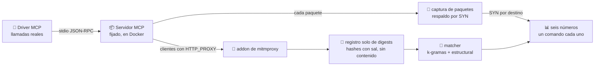

<div align="center">

# 🔭 mcp-fanout

### ¿A dónde envía realmente tus datos la llamada a una herramienta de un agente de IA?

**Un arnés de medición que ejecuta servidores MCP reales, invoca sus herramientas, captura cada
conexión saliente y mide qué parte de ese tráfico se puede atribuir a la llamada exacta que lo
provocó, sin almacenar un solo byte de contenido.**

[](https://github.com/marcosmatalab/mcp-fanout/actions/workflows/ci.yml)
[](https://github.com/marcosmatalab/mcp-fanout/releases)
[](tests/)
[](Makefile)
[](pyproject.toml)
[](pyproject.toml)
[](tests/test_core_has_no_dependencies.py)
[](LICENSE)

[English](README.md) · **Español**

</div>

---

## ⚡ En 30 segundos

Los agentes de IA actúan a través de **herramientas** (el Model Context Protocol, MCP). Cuando un
agente llama a una herramienta, el servidor que hay detrás puede contactar con terceros: APIs,
registros de paquetes, navegadores, CDNs. Nadie registra **qué llamada provocó qué conexión**, y esa
es justo la evidencia que piden un equipo de seguridad, un auditor o un regulador.

`mcp-fanout` lo mide de principio a fin:

| | Paso | Cómo |
| :---: | --- | --- |
| 1️⃣ | **Ejecuta** servidores MCP reales, con versión fijada, en un contenedor aislado | Arnés Docker, un driver MCP por stdio, corpus reproducibles |
| 2️⃣ | **Observa** cada conexión que sale de la máquina | mitmproxy **más** una captura a nivel de paquete que ve lo que el proxy no ve |
| 3️⃣ | **Atribuye** cada flujo saliente a la llamada que lo causó | Emparejamiento por k-gramas y estructural sobre digests con sal, sin contenido |
| 4️⃣ | **Publica** seis números, cada uno con el comando que lo reproduce | La CI regenera cada figura y falla ante cualquier desviación |

## 🧠 En plata

Imagina un agente al que se le pide *"resume esta página web"*. Llama a una herramienta,
`fetch(url)`. Detrás de esa única llamada, el servidor puede descargar la página, bajarse un parser
de un registro de paquetes y llegar a una CDN. Desde fuera ves varias conexiones y **ningún vínculo
entre ellas y la llamada que las provocó**.

`mcp-fanout` produce ese vínculo, como evidencia (salida ilustrativa):

```text
llamada #17  fetch(url=…)                   ──►  api.example.com       ✅ atribuida a #17
                                            ──►  registry.npmjs.org    📦 infraestructura de paquetes
                                            ──►  cdn.example.net       ❔ vista, causa no demostrable
```

**Por qué importa.** Cuando un agente mueve datos, las preguntas tras un incidente son siempre las
mismas: *¿qué acción envió qué, a dónde, y puedes demostrarlo?* Un gateway ve el tráfico, pero no
ata cada conexión a la llamada que la provocó. Este arnés mide si esas preguntas **se pueden**
responder desde el borde de la propia máquina, con qué frecuencia y con qué coste en privacidad,
antes de que nadie construya un producto dándolo por hecho.

## 📊 De un vistazo

<div align="center">

| 🧪 **691** | 🛰️ **10** | 🧰 **87** | 📞 **156** | 🎯 **1.0** | 🔐 **0** |
| :---: | :---: | :---: | :---: | :---: | :---: |
| tests automatizados | servidores MCP medidos, con versión fijada | esquemas reales de herramientas sondeados | llamadas ejecutadas y trazadas | recall del sensor en el banco controlado | bytes de contenido almacenados |

</div>

- ✅ **Cero atribuciones fuertes falsas** sobre 33 atribuciones fuertes en el banco controlado, y procedencia falsa de **0.0**.
- 🎯 **Matcher calibrado con una curva, no a mano:** falsos positivos reducidos de 66 de 224 pares a **0 de 224** (cota superior Wilson 95% del 1,7%) sobre una mitad reservada con la que nunca se ajustó.
- 🔒 **Pre-registrado:** cada predicción y cada umbral sellados con un digest SHA-256 *antes* de que existieran los datos. Editar uno a posteriori rompe la suite de tests.
- 💶 **0 EUR** en cómputo cloud o APIs de pago. Cada número publicado se reproduce **offline**, en un clon limpio, sin Docker y sin claves.

## 🔍 Qué encontró

> **1. Tu proxy no ve el tráfico de tu agente.** 🕳️
> Un proxy configurado con `HTTP_PROXY` solo ve a los clientes que deciden respetarlo. El `fetch`
> global de Node no lo hace por defecto: uno de los tres componentes que llegaron a un tercero
> completó 16 de 17 llamadas y dejó **cero flujos** en el proxy. La captura de paquetes lo detectó:
> diez conexiones pasando por fuera. ([amenaza 19](docs/THREATS.md))

> **2. Un servidor fijado no es código fijado.** 📦
> `mcp-server-fetch`, fijado a una versión exacta, ejecuta `npm install` **dentro de la llamada a la
> herramienta**: **41 paquetes** con rangos sin fijar, sin lockfile, 87 peticiones al registro un
> día y 82 al siguiente. Comunicado a ambos mantenedores mediante divulgación responsable
> ([ReadabiliPy#122](https://github.com/alan-turing-institute/ReadabiliPy/issues/122),
> [servers#4830](https://github.com/modelcontextprotocol/servers/issues/4830)).

> **3. La atribución depende de la forma de los argumentos.** 🧬
> Sobre los 87 esquemas sondeados: el **38%** de las herramientas es atribuible solo con el esquema,
> el **22%** no lo es nunca por contenido y el **40%** depende del valor concreto. Una regla de
> diseño para cualquier producto de trazado, medida con `make argument-shapes`.


## 🏗️ Cómo funciona



**Principios de diseño**, aplicados en código y en tests ([`docs/DOCTRINE.md`](docs/DOCTRINE.md)):

| Principio | Qué significa |
| --- | --- |
| 👁️ **Observar, nunca actuar** | Un observador pasivo en el borde de la propia máquina. Nunca bloquea, inyecta ni reescribe tráfico |
| 🔐 **Nunca almacenar contenido** | Solo llegan a disco digests con sal y referencias. Los argumentos se comparan como hashes |
| 🧭 **Nunca inferir** | Ocurrencia, procedencia y atribución son afirmaciones separadas, graduadas en seis niveles explícitos |
| 🧱 **Núcleo solo con la librería estándar** | El núcleo de medición tiene **cero** dependencias de terceros, comprobado por un test y por un job de CI |

## 📐 Los seis números

Dos pasadas independientes sobre los mismos diez servidores: `20260919T115452Z-sequential` (26
llamadas, de una en una) y `20260919T194649Z-concurrent` (130 llamadas en oleadas de 2, 5 y 10).
Cada número se lee solo de la pasada que puede responderlo.

| # | Número | Qué responde | Respuesta | Pasada | Comando |
| --- | --- | --- | --- | --- | --- |
| 1 | 🔗 Conexiones salientes por llamada | Cuánto se abre en abanico una sola llamada | bruto p50 **0**, p95 **3**, máx **84**; sin infraestructura de paquetes p50 **0**, p95 **2**, máx **3** | secuencial | `make n1 RUN=example-sequential` |
| 2 | 🌐 Dominios distintos por llamada | A cuántos terceros toca una llamada | p50 **0**, p95 **2**, máx **3** | secuencial | `make n2 RUN=example-sequential` |
| 3 | 🧵 Servidores que propagan `traceparent` | Si el contexto de traza W3C sirve hoy | **0** de **10** servidores | secuencial | `make n3 RUN=example-sequential` |
| 4 | 🛡️ Bytes salientes que coinciden con ficheros de contexto | Si se filtran secretos del contexto | **0** bytes, en todas las ejecuciones | secuencial | `make n4 RUN=example-sequential` |
| 5 | 🎯 Flujos atribuibles a la llamada que los causó | Si la procedencia por llamada funciona | **0.6579** de los flujos elegibles, frente a un umbral pre-registrado de **0.8** | concurrente | `make n5 RUN=example-concurrent` |
| 6 | 🏠 Terceros tocados que son auto-alojables | Hasta dónde puede extenderse un observador de borde | **0.0** sobre **5** nodos | concurrente | `make n6 RUN=example-concurrent` |

La cifra principal se midió tres veces mientras se endurecía el instrumento, y cada mejora la hizo
más estricta:


## ⚖️ Decisiones de diseño y sus costes

Cada decisión está escrita con su motivo y su coste medido, en el código y en
[`docs/`](docs/README.md). Las principales:

| Decisión | Por qué | Qué cuesta |
| --- | --- | --- |
| 🔐 **Guardar digests, nunca contenido** | Trazar un agente no puede convertirse en un nuevo sitio por donde se filtren sus datos | Una coincidencia no se puede releer después; las ejecuciones se publican redactadas y no se pueden reclasificar contra un registro más nuevo |
| 🎯 **Ventana de emparejamiento k = 22, elegida con una curva** | Con k = 22 los falsos positivos caen a cero en las dos mitades del control negativo | El recall sobre texto realista baja de 0.475 a 0.4. Cada fallo reduce la parte atribuida, que es la dirección segura |
| 👁️ **Observador pasivo en el borde local** | No se inyecta ninguna marca, cabecera ni código en terceros, así que observar nunca altera lo observado | Más allá del primer salto remoto no auto-alojable no se ve nada sin la cooperación de su operador |
| 📡 **Proxy más captura de paquetes** | El proxy lee lo que lo respeta; la captura cuenta todo lo que sale | Las conexiones que esquivan el proxy se cuentan y se localizan, pero no se leen |
| 🔀 **Dos pasadas separadas** | De una en una se responde "¿cuánto se abre una llamada?"; en oleadas de 2, 5 y 10, "¿se distinguen las llamadas concurrentes?" | Dos capturas en lugar de una, y ninguna pasada puede publicar los números de la otra |
| 🧱 **Núcleo solo con la librería estándar** | Una dependencia que cambia un número es justo el fallo de cadena de suministro que estudia el proyecto | Más código escrito y testeado en casa |
| 🧪 **Ponderación por rareza medida y revertida** | No redujo la tasa de falsos positivos sobre datos reservados | Se conserva como resultado negativo documentado, fuera del camino de emparejamiento |

## 🛠️ Calidad de ingeniería

| | |
| --- | --- |
| 🚦 **CI en un comando** | `make gates` ejecuta el pipeline completo en local, en el orden de la CI: tests, cifras, figuras, corpus, pre-registro, reproducción, lint, tipos y cobertura |
| 🧪 **691 tests** | Tests unitarios, de integración y de regresión. Cada instrumento tiene un test que falla si el instrumento *no está*, no solo si se equivoca |
| 📏 **Cada cifra tiene gate** | `make claims-check` compara cada número de la tabla de los seis números con el artefacto commiteado del que sale |
| 🔁 **Se regenera, no se inspecciona** | `make figures-check` reconstruye cada figura de calibración y ambos SVG, y falla ante cualquier diff |
| 🧾 **Ciencia pre-registrada** | Predicciones congeladas por digest antes de medir ([`docs/PREREG-F2.md`](docs/PREREG-F2.md)); el matcher se ajusta con una mitad de los datos y se publica con la otra |
| 🔏 **Historial firmado** | Cada commit desde `c6d4e64` está firmado con GPG |
| 🤝 **Divulgación responsable** | `make disclosure` aísla por servidor los destinos no declarados; los hallazgos llegan a los mantenedores antes de publicarse ([`docs/DISCLOSURE-LOG.md`](docs/DISCLOSURE-LOG.md)) |

## 🚀 Inicio rápido

Python 3.11+. Todo lo siguiente funciona **offline** sobre las ejecuciones commiteadas; solo una
captura nueva necesita Docker y red.

```bash
make install                            # instalación editable con los extras de desarrollo
make honesty-curve                      # la cifra principal, en 0.05 s
make reproduce                          # la cifra principal de punta a punta desde las ejecuciones commiteadas
make numbers RUN=example-sequential     # los seis números (o n1 .. n6)
make backstop RUN=example-concurrent    # SYN salientes por destino: lo que un proxy no ve
make gates                              # todo lo que ejecuta la CI, en su orden
make run                                # una captura NUEVA en vivo (Docker + red)
```

## 🗂️ Estructura del repositorio

```text
src/mcpfanout/   núcleo de medición (solo librería estándar), driver MCP, addon de captura
harness/         imagen Docker y orquestación de la captura
bench/           fase A: nuestro propio servidor MCP y sumidero HTTP, donde la respuesta se conoce
corpus/          corpus de llamadas, control negativo, control positivo, documentos de fondo
registry/        servidores fijados, esquemas sondeados, listas de clasificación
tools/           generadores de figuras, redacción, notas de release, presupuesto de documentación
runs/            dos ejecuciones de ejemplo redactadas, para reproducir cada número offline
docs/            método, protocolo, calibración, amenazas, pre-registro, registro de divulgación
tests/           691 tests y un servidor MCP simulado
```

## 📚 Documentación

La documentación técnica está en inglés.

| Si quieres | Lee |
| --- | --- |
| 🧭 Un mapa de todos los documentos y su extensión | [`docs/README.md`](docs/README.md) |
| 🔬 El modelo de observación y los seis números | [`docs/METHOD.md`](docs/METHOD.md) |
| 🚦 Las diez reglas del gate, las fases y los criterios de parada | [`docs/PROTOCOL.md`](docs/PROTOCOL.md) |
| 🎛️ Cómo se calibró el matcher | [`docs/CALIBRATION.md`](docs/CALIBRATION.md) |
| 🔒 El pre-registro sellado | [`docs/PREREG-F2.md`](docs/PREREG-F2.md) |
| 📣 Qué se comunicó, a quién y cuándo | [`docs/DISCLOSURE-LOG.md`](docs/DISCLOSURE-LOG.md), [`SECURITY.md`](SECURITY.md) |
| 🧑‍💻 Cómo ejecutar los gates y contribuir | [`CONTRIBUTING.md`](CONTRIBUTING.md) |

⚠️ Las limitaciones conocidas y las amenazas a la validez están documentadas en [`docs/THREATS.md`](docs/THREATS.md).

## 📦 Release y cita

`v1.0.0` se publica el 19 de octubre de 2026, cuando se cierra la ventana de divulgación, y su DOI
se genera entonces. Cita la release archivada y no la rama por defecto: toma la vigente de
[releases/latest](https://github.com/marcosmatalab/mcp-fanout/releases/latest) y los metadatos de
[`CITATION.cff`](CITATION.cff).

---

<div align="center">

Creado por **[Marcos Mata García](https://github.com/marcosmatalab)** · Apache-2.0 · [LICENSE](LICENSE)

</div>
