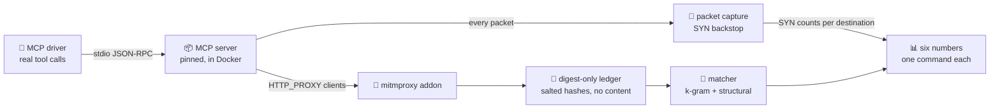

<div align="center">

# 🔭 mcp-fanout

### Where does an AI agent's tool call actually send your data?

**A measurement harness that runs real MCP servers, drives their tools, captures every outbound
connection and measures how much of that traffic can be traced back to the exact tool call that
caused it, without storing a single byte of content.**

[](https://github.com/marcosmatalab/mcp-fanout/actions/workflows/ci.yml)
[](https://github.com/marcosmatalab/mcp-fanout/releases)
[](tests/)
[](Makefile)
[](pyproject.toml)
[](pyproject.toml)
[](tests/test_core_has_no_dependencies.py)
[](LICENSE)

**English** · [Español](README.es.md)

</div>

---

## ⚡ In 30 seconds

AI agents act through **tools** (the Model Context Protocol, MCP). When an agent calls a tool, the
server behind it may contact third parties: APIs, package registries, browsers, CDNs. Nobody
records **which call caused which connection**, and that is exactly the evidence a security team,
an auditor or a regulator asks for.

`mcp-fanout` measures it, end to end:

| | Step | How |
| :---: | --- | --- |
| 1️⃣ | **Run** real, version-pinned MCP servers in an isolated container | Docker harness, a stdio MCP driver, reproducible corpora |
| 2️⃣ | **Observe** every connection that leaves the machine | mitmproxy **plus** a packet-level capture that catches what the proxy cannot |
| 3️⃣ | **Attribute** each outbound flow to the tool call that caused it | content-free k-gram and structural matching over salted digests |
| 4️⃣ | **Publish** six numbers, each with the one command that reproduces it | CI regenerates every figure and fails on any drift |

## 🧠 In plain terms

Picture an agent asked to *"summarise this web page"*. It calls one tool, `fetch(url)`. Behind that
single call, the server may download the page, pull a parser from a package registry and reach a
CDN. From the outside you see a handful of connections and **no link between them and the call
that caused them**.

`mcp-fanout` produces that link, as evidence (illustrative output):

```text
tool call #17  fetch(url=…)                  ──►  api.example.com       ✅ attributed to #17
                                             ──►  registry.npmjs.org    📦 package infrastructure
                                             ──►  cdn.example.net       ❔ seen, cause not provable
```

**Why it matters.** When an agent moves data, the questions after an incident are always the same:
*which action sent what, where, and can you prove it?* A gateway sees the traffic, but it does not
tie each connection to the call that caused it. This harness measures whether those questions
**can** be answered from the machine's own edge, how often, and at what privacy cost, before anyone
builds a product on the assumption that they can.

## 📊 At a glance

<div align="center">

| 🧪 **715 passing** | 🛰️ **10** | 🧰 **87** | 📞 **156** | 🎯 **1.0** | 🔐 **0** |
| :---: | :---: | :---: | :---: | :---: | :---: |
| tests, in a clean clone | pinned MCP servers measured | real tool schemas probed | tool calls driven and traced | sensor recall on the controlled bench | bytes of content ever stored |

</div>

- ✅ **Zero false strong attributions** over 33 strong claims on the controlled bench, and false provenance of **0.0**.
- 🎯 **Matcher calibrated by a curve, not by hand:** false positives cut from 66 of 224 pairs to **0 of 224** (Wilson 95% upper bound 1.7%) on a held-out set it was never tuned on.
- 🔒 **Pre-registered:** every prediction and threshold sealed by SHA-256 digest *before* the data existed. Editing one after the fact fails the test suite.
- 💶 **0 EUR** of cloud compute or paid APIs. Every published number reproduces **offline**, in a clean clone, with no Docker and no keys.

## 🔍 What it found

> **1. Your proxy saw only 2 of the 3 components that reached a third party.** 🕳️
> A proxy set through `HTTP_PROXY` sees only the clients that choose to honour it. Node's global
> `fetch` does not by default, so one of the three components that reached a third party completed
> 16 of 17 calls and left **0 flows** in the proxy while they ran. The packet-level backstop caught
> it: **10 connections** going straight past. Reproduced offline from the committed run with
> `make backstop RUN=example-blind-proxy`. ([threat 19](docs/THREATS.md))

> **2. A pinned server is not pinned code.** 📦
> `mcp-server-fetch`, pinned to an exact version, runs `npm install` **inside the tool call**:
> **41 packages** from unpinned ranges, no lockfile, 87 registry requests one day and 82 the next.
> Reported to both maintainers under responsible disclosure
> ([ReadabiliPy#122](https://github.com/alan-turing-institute/ReadabiliPy/issues/122),
> [servers#4830](https://github.com/modelcontextprotocol/servers/issues/4830)).

> **3. Attribution depends on the shape of a tool's arguments.** 🧬
> Across all 87 probed schemas: **38%** of tools are attributable from the schema alone, **10%**
> never can be by content, **52%** depend on the value passed. A design rule for any tracing
> product, measured with `make argument-shapes`.


## 🏗️ How it works



**Design principles**, enforced in code and tests ([`docs/DOCTRINE.md`](docs/DOCTRINE.md)):

| Principle | What it means |
| --- | --- |
| 👁️ **Observe, never act** | A passive observer at the machine's own edge. It never blocks, injects or rewrites traffic |
| 🔐 **Never store content** | Only salted digests and references reach disk. Arguments are matched as hashes |
| 🧭 **Never infer** | Occurrence, provenance and attribution are separate claims, graded in six explicit levels |
| 🧱 **Standard-library core** | The measurement core has **zero** third-party dependencies, checked by a test and by a CI job |

## 📐 The six numbers

Two independent passes over the same ten servers: `20260919T115452Z-sequential` (26 calls, one at a
time) and `20260919T194649Z-concurrent` (130 calls in waves of 2, 5 and 10). Each number is read
only from the pass that can answer it, and CI checks every cell below against the committed data.

| # | Number | What it answers | Answer | Pass | Command |
| --- | --- | --- | --- | --- | --- |
| 1 | 🔗 Outbound connections per tool call | How much a single call fans out | raw p50 **0**, p95 **3**, max **84**; excluding package infrastructure p50 **0**, p95 **2**, max **3** | sequential | `make n1 RUN=example-sequential` |
| 2 | 🌐 Distinct domains per tool call | How many third parties one call touches | p50 **0**, p95 **2**, max **3** | sequential | `make n2 RUN=example-sequential` |
| 3 | 🧵 Servers propagating `traceparent` | Whether W3C trace context is usable today | **0** of **10** servers | sequential | `make n3 RUN=example-sequential` |
| 4 | 🛡️ Outbound bytes matching context files | Whether secrets in context leak out | **0** bytes, in every run | sequential | `make n4 RUN=example-sequential` |
| 5 | 🎯 Flows attributable to their causing call | Whether per-call provenance works | **0.6579** of eligible flows, against a pre-registered bar of **0.8** | concurrent | `make n5 RUN=example-concurrent` |
| 6 | 🏠 Touched third parties that are self-hostable | How far an edge observer can extend | **0.0** over **5** nodes | concurrent | `make n6 RUN=example-concurrent` |

The headline was measured three times as the instrument was hardened, and every fix made it stricter:


## ⚖️ Design trade-offs

Every decision is written down with its reason and its measured cost, in the code and in
[`docs/`](docs/README.md). The main ones:

| Decision | Why | What it costs |
| --- | --- | --- |
| 🔐 **Store digests, never content** | Tracing an agent must not become a new place where its data leaks | A match cannot be re-read later; runs are published redacted and cannot be re-classified against a newer registry |
| 🎯 **Matching window k = 22, chosen by a curve** | At k = 22 false positives drop to zero on both halves of the negative control | Self-match recall on realistic text falls from 0.475 to 0.4. Every miss lowers the attributed share, which is the safe direction |
| 👁️ **Passive observer at the local edge** | No marker, header or code is injected into third parties, so observing never changes what is observed | Nothing beyond the first remote, non-self-hostable hop is visible without its operator's cooperation |
| 📡 **Proxy plus packet capture** | The proxy reads what honours it; the capture counts everything that leaves | Connections that bypass the proxy are counted and located, not read |
| 🔀 **Two separate passes** | One call at a time answers "how much does a call fan out?"; waves of 2, 5 and 10 answer "can concurrent calls be told apart?" | Two captures instead of one, and neither pass may publish the other's numbers |
| 🧱 **Standard-library-only core** | A dependency that changes a number is the supply-chain failure this project studies | More code written and tested in-house |
| 🧪 **Rarity weighting measured, then reverted** | It did not lower the false-positive rate on held-out data | Kept in the codebase as a documented negative result, out of the matching path |

## 🛠️ Engineering quality

| | |
| --- | --- |
| 🚦 **One-command CI** | `make gates` runs the whole pipeline locally, in CI's order: tests, claims, figures, corpus, pre-registration, reproduction, lint, types, coverage |
| 🧪 **715 passing tests** | Unit, integration and regression tests. Each instrument has a test that fails when the instrument is *absent*, not only when it is wrong |
| 📏 **Every claim is gated** | `make claims-check` compares every number in the six-number table with the committed artifact it comes from |
| 🔁 **Regenerated, not inspected** | `make figures-check` rebuilds every calibration figure and both SVGs and fails on a non-empty diff |
| 🧾 **Pre-registered science** | Predictions frozen by digest before measuring ([`docs/PREREG-F2.md`](docs/PREREG-F2.md)); a matcher tuned on one half of the data and published on the other |
| 🔏 **Signed history** | Every commit from `c6d4e64` onward is GPG-signed; earlier commits are deliberately not re-signed |
| 🤝 **Responsible disclosure** | `make disclosure` isolates undeclared destinations per server; findings go to maintainers before publication ([`docs/DISCLOSURE-LOG.md`](docs/DISCLOSURE-LOG.md)) |

## 🚀 Quickstart

Python 3.11+. Everything below runs **offline** against the committed runs; only a new capture needs
Docker and network.

```bash
make install                            # editable install with dev extras
make honesty-curve                      # the headline figure, in 0.05 s
make reproduce                          # the headline number end to end from the committed runs
make numbers RUN=example-sequential     # the six numbers (or n1 .. n6)
make backstop RUN=example-blind-proxy   # finding 1: SYNs the proxy never saw, calls it missed
make gates                              # everything CI runs, in CI's order
make run                                # a NEW live capture (Docker + network)
```

## 🗂️ Repository layout

```text
src/mcpfanout/   measurement core (standard library only), MCP driver, capture addon
harness/         Docker image and capture orchestration
bench/           phase A: our own MCP server and HTTP sink, where the right answer is known
corpus/          call corpora, negative control, positive control, background documents
registry/        pinned servers, probed tool schemas, classification lists
tools/           figure renderers, redaction, release notes, documentation budget
runs/            two redacted example runs, so every number reproduces offline
docs/            method, protocol, calibration, threats, pre-registration, disclosure log
tests/           715 passing tests plus a mock MCP server
```

## 📚 Documentation

| If you want | Read |
| --- | --- |
| 🧭 A map of every document and how long it is | [`docs/README.md`](docs/README.md) |
| 🔬 The observation model and the six numbers | [`docs/METHOD.md`](docs/METHOD.md) |
| 🚦 The ten gate rules, the phases and the stop criteria | [`docs/PROTOCOL.md`](docs/PROTOCOL.md) |
| 🎛️ How the matcher was calibrated | [`docs/CALIBRATION.md`](docs/CALIBRATION.md) |
| 🔒 The sealed pre-registration | [`docs/PREREG-F2.md`](docs/PREREG-F2.md) |
| 📣 What was disclosed, to whom and when | [`docs/DISCLOSURE-LOG.md`](docs/DISCLOSURE-LOG.md), [`SECURITY.md`](SECURITY.md) |
| 🧑‍💻 How to run the gates and contribute | [`CONTRIBUTING.md`](CONTRIBUTING.md) |

⚠️ Known limitations and threats to validity are documented in [`docs/THREATS.md`](docs/THREATS.md).

## 📦 Release and citation

`v1.0.0` is published on 19 October 2026, when the disclosure window closes. The first two release
candidates, rc1 and rc2, were archived on Zenodo automatically when they were published
([10.5281/zenodo.22898049](https://doi.org/10.5281/zenodo.22898049),
[10.5281/zenodo.22901070](https://doi.org/10.5281/zenodo.22901070)); later candidates are published
with the Zenodo webhook paused, so the next DOI is the one for `v1.0.0`. Cite the archived release rather than the default branch: take the current one from
[releases/latest](https://github.com/marcosmatalab/mcp-fanout/releases/latest) and the metadata
from [`CITATION.cff`](CITATION.cff).

---

<div align="center">

Built by **[Marcos Mata García](https://github.com/marcosmatalab)** · Apache-2.0 · [LICENSE](LICENSE)

</div>
