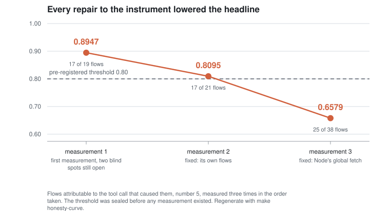

# mcp-fanout

[](https://github.com/marcosmatalab/mcp-fanout/actions/workflows/ci.yml)
[](https://github.com/marcosmatalab/mcp-fanout/releases)
[](LICENSE)

## Your proxy does not see your agent's traffic

A proxy selected by `HTTP_PROXY` and `HTTPS_PROXY` does not observe an agent's egress. It observes
the subset of its clients that chose to honour two environment variables, and that subset is not
knowable in advance.

Here that subset silently excluded **one of the three components** that reached a third party: it
completed 16 of 17 calls, returned the API's own answers, and recorded **zero flows**. The packet
capture caught it, not the proxy: ten connections going straight past. Full chain in
[`docs/THREATS.md`](docs/THREATS.md), threat 19.

Every repair to the instrument **lowered** the headline: **0.8947, then 0.8095, then 0.6579**,
against a threshold of 0.80 sealed before any measurement existed. A measurement whose headline
improves when its instrument improves is measuring the instrument. This one did the opposite.

Reproduce it on your machine in five seconds, with no network and no keys:

```bash
make install && make honesty-curve
```



## What you take away, even if you run nothing

1. **If you instrument agents with an environment-variable proxy, you are missing traffic.** Node's
   global `fetch` and `undici` do not honour those variables by default. The capability exists from
   Node 22.21 and 24.5 and is still off: it is turned on with `NODE_USE_ENV_PROXY=1`. An image
   running Node 20 cannot see that traffic under any configuration.
2. **Packet capture is the only judge.** Anything going somewhere that is not the proxy is traffic
   your instrument is not reading. `make backstop` counts SYNs per destination, and that count is
   what found point 1.
3. **Attribution depends on the shape of the arguments, not on the tool.** A call that commits two
   or more structural tokens attributes uniquely; a call that commits one does not, under any rule
   that does not manufacture false attributions. Over 87 measured tool schemas: **38%** are
   attributable from the schema alone, **22%** can never be, **40%** are not knowable until a value
   is seen. `make argument-shapes`, no capture and no network.


## What this is, and what it is not

This repository is a **measurement**, not a product. It was built to produce six numbers that would
decide whether a runtime tracing product is worth building and, if so, which of two architectures it
should have. The rationale for measuring before building is in
[`docs/METHOD.md`](docs/METHOD.md): you cannot design the causal-union layer without knowing the
fan-out, and choosing blind means building the wrong one.

| It is | It is not |
| --- | --- |
| A harness that runs real MCP servers in a container and observes their egress | A gateway, a firewall, or anything that blocks traffic |
| An observer at the **own edge**: it watches bytes leaving the local machine and bytes coming back | An injector: it never plants a marker, a token, or code inside a third party |
| A producer of aggregate counts, with a command behind every number | A dataset of who-calls-whom; it names no server and no organization in aggregate output |
| Digest-only: it stores salted hashes and references, never captured content | A DLP product, a content archive, or a monitoring service |

The design follows four standing rules (the doctrine, [`docs/DOCTRINE.md`](docs/DOCTRINE.md)). The
one that shapes everything here: **never act on what is observed, only observe.** That is why this
is an edge observer and not a marker that travels the chain. A marker cannot be passive and report
at the same time, and a chain deeper than the first non-self-hostable node is not observable by
anyone without cooperation. That limit is physical, not an engineering gap, and it is stated as a
result rather than hidden.

## What was measured, and on what

Measured across two runs, published separately and never merged
([`docs/PROTOCOL.md`](docs/PROTOCOL.md)): `20260919T115452Z-sequential`, 26 calls one at a time,
which numbers 1 to 4 are read from, and `20260919T194649Z-concurrent`, 130 calls in waves of 2, 5
and 10, which is the only pass number 5 may be read from. Ten pinned MCP servers, of which three
egress at all and six are local by design: numbers 1, 2 and 6 therefore rest on two servers, and
that is stated here rather than in a footnote.

Every server is pinned to an exact version in [`registry/servers.yaml`](registry/servers.yaml) and
its tool schemas are committed under `registry/probes/`. We do not claim they are the ten most
installed: we never measured an install ranking, and rule 6 says a claim without a command behind it
does not get published.

Both runs are committed in redacted form under [`runs/`](runs/README.md), which is what makes every
command below work in a clean clone with no Docker, no network and no credentials.

## The six numbers

Each number has exactly one command that computes it (doctrine rule 6: no published number without
a command that measures it). Full definitions in [`docs/METHOD.md`](docs/METHOD.md).

| # | Number | What it was asked to decide | Answer | Pass | Command |
| --- | --- | --- | --- | --- | --- |
| 1 | Outbound connections per tool call | Whether the causal union is trivial or is the product | raw p50 **0**, p95 **3**, max **84**; excluding package infrastructure p50 **0**, p95 **2**, max **3**. The median call reaches nothing; the maximum is one server installing a package mid-call (threat 17) | sequential | `make n1 RUN=example-sequential` |
| 2 | Distinct domains per tool call | The size of the publishable finding | p50 **0**, p95 **2**, max **3** | sequential | `make n2 RUN=example-sequential` |
| 3 | Servers propagating `traceparent` | Whether the cooperative path is worth anything today | **0** of **10** driven, and 0 of the **2** whose egress the proxy could see at all. The cheap fix nobody has adopted | sequential | `make n3 RUN=example-sequential` |
| 4 | Outbound bytes matching context files | Whether content matching has signal at all | **0** matched bytes, in every run. Nothing leaked, and the k-gram matcher is untouched by this work | sequential | `make n4 RUN=example-sequential` |
| 5 | Flows attributable to their causing call | **Whether the whole product works** | **0.6579** against a sealed **0.8**. **Not met**, and the product verdict was left unfrozen on purpose | concurrent | `make n5 RUN=example-concurrent` |
| 6 | Touched third parties that are self-hostable | How far the edge can advance before the chain breaks | **0.0** over **5** nodes. The recursion buys nothing here | concurrent | `make n6 RUN=example-concurrent` |

Numbers 1 and 2 are read **only** from the sequential pass and number 5 **only** from the concurrent
one: with ten calls in flight, "connections per call" is a figure about our own wave size, and with
a single call in flight the strong attribution grade is unreachable by construction. The rule is in
[`docs/PROTOCOL.md`](docs/PROTOCOL.md), and `make claims-check` fails if this table breaks it. It
has broken it: this table published number 1 as `p95 1` from the pass that may not answer, where
the pass that may says **84**.

Number 5 was the decisive one and it is the one that failed. Numbers 1 to 4 are the write-up; number
6 sizes a recursion that turned out to have nothing to recurse into. The three denominators behind
number 5 are published together and never one alone, because this project has caught a contaminated
denominator three times; see [`docs/PREREG-F2.md`](docs/PREREG-F2.md) section 16.

## What the eventual product would be, and what category it is not in

The harness measured, and the stop criteria fired. The question it was built to inform was whether
to build:

> **Runtime provenance and evidence for autonomous agents.**

**The answer is not in this README, and that is deliberate.** The instrument failed its own
pre-registered threshold (0.6579 against 0.80), which says the measuring apparatus is not good
enough to settle the product question, not that the product question is settled. The product verdict
was therefore **left unfrozen on purpose**, and that refusal is itself inside the sealed
pre-registration block so it could not be replaced by a verdict once a result existed: see
[`docs/PREREG-F2.md`](docs/PREREG-F2.md) section 8, which names the two threats that made a verdict
from this sample unsound. Development stopped there.

MCP is the **first supported environment**, not the category. Both of the obvious alternative
framings are wrong in a way that costs money:

- **Not "MCP security".** It ties the product to one protocol that is still changing under it (the
  current revision removed the session, the handshake and three methods in a single release) and to
  a function that a gateway absorbs as a feature the moment it is worth having.
- **Not "data lineage".** That is Cyberhaven's category. Entering an occupied category with a
  smaller version of the incumbent's story is not a positioning, it is a comparison you lose by
  default.

What "runtime provenance and evidence" claims, and it is narrower than either: at the moment an
autonomous agent acts, what left, where it went, and what evidence ties the two to the action that
caused it. Runtime rather than configuration, evidence rather than inference, provenance rather than
policy. The agent is the subject; the protocol it happens to speak is an adapter.

## The evidence model: three separate claims

Every outbound connection carries three claims, recorded and reported separately. They are never
joined in one sentence, because a single word for all three is what the previous model did and it
could not answer any of them precisely.

| Claim | Question it answers | Values |
| --- | --- | --- |
| Occurrence | was the transfer observed, and readable | `observed`, `connection_only` |
| Provenance | did the request carry recognisable material of ours | `none`, `context`, `arguments`, `both`, `unknown` |
| Attribution | could it be tied to a tool call, and how strongly | six grades, below |

Attribution is graded, strongest first. A grade claims a QUALITY OF EVIDENCE, never certainty of
cause.

| Grade | Evidence |
| --- | --- |
| `TRACE_PROPAGATED` | our exact W3C `traceparent` was in the outbound request |
| `CONTENT_UNIQUE` | several calls in flight, matched fragment present in exactly one |
| `CONTENT_AMBIGUOUS` | several calls in flight, fragment in several: content did not discriminate |
| `CONTENT_MATCH_UNCONTESTED` | a match with only one call in flight, so nothing was told apart |
| `TEMPORAL_ONLY` | a time window and a pid, nothing else |
| `UNATTRIBUTED` | no evidence, or ineligible, always with a named reason |

Strong attribution counts the first two only. `CONTENT_UNIQUE` requires more than one call in
flight, so **a sequentially driven run emits none, by construction, and a test asserts it.** Anything
else would publish the experimental setup as a result.

| Pass | Command | Publishes | May not claim |
| --- | --- | --- | --- |
| Sequential, one call in flight | `make run` | numbers 1, 2, 3, 4 | anything about whether content discriminates |
| Concurrent, waves of N = 2, 5, 10 | `make run-concurrent` | number 5, split by N | any per-call fan-out figure |

Merging them would average two experimental conditions into one distribution, so the harness refuses
to write both into one run. Neither pass has ground truth and neither needs it: precision was
measured where it has a denominator, on the phase A bench.

## Quickstart

Requirements: Python 3.11+. Docker is needed for a new capture only, which is the last of the ten
commands below. Everything else runs offline, against artifacts committed to this repository.

```bash
# 0. What everything does. `make` on its own prints this
make help

# 1. Install (editable) and dev deps
make install

# 2. Run the pure-Python core against synthetic fixtures and prove reproducibility
make verify

# 3. The headline number, end to end, from the committed example runs. No network, no keys
make reproduce

# 4. Any single number, from the pass that may publish it
make n1 RUN=example-sequential      # or n2 ... n6, and `make numbers` for all six

# 5. The headline figure at each stage of the instrument becoming less blind
make honesty-curve

# 6. How much of a tool surface is attributable, from committed schemas alone
make argument-shapes

# 7. What the proxy could NOT see: outbound SYNs per destination, from the pcap backstop
make backstop RUN=example-concurrent

# 8. Gate rule 7: which destinations nobody declared. Non-zero exit means stop and review
make disclosure RUN=example-concurrent

# 9. The F2 matcher's pre-registered predictions, on calibration material
make f2                             # make f2-reserved measures the reserved half, ONCE, at the end

# 10. A NEW capture. The only command here that needs Docker and network
make run                            # and make run-concurrent, a separate run and a separate figure
```

The gates that keep all of the above honest are `make claims-check`, `make figures-check`,
`make corpus-check` and `make reproduce`, and `make gates` runs every one of them in the order CI
does. What each gate caught, and why an inspecting test could not have caught it, is in
[`CONTRIBUTING.md`](CONTRIBUTING.md).

See [`docs/METHOD.md`](docs/METHOD.md) for the observation model and the capture layers, and
[`docs/PROTOCOL.md`](docs/PROTOCOL.md) for the phases, the two phase B passes and the **ten**
conditions a run must pass before any number is reported. Rule 10 was added last and earned its
place by being violated: **every instrument needs a test that fails when the instrument is ABSENT,
not only when it is wrong.** A wrong number gets investigated; a green gets published. There are
seven recorded instances, and three of them are in prose and figures rather than in code.

## Reproducibility, privacy, disclosure

- **Reproducible, at two levels, and the distinction matters.** What reproduces byte for byte is the
  measurement CORE over fixtures (`make verify`), the calibration figures (`make figures-check`) and
  the **normalized aggregate of a given run** (`make reproduce`). What does **not** reproduce is a
  new capture: it contacts live third parties, and the measured environment changes between days.
  That is not a caveat, it is one of this project's findings, measured as 87 package-registry
  requests on one day and 82 on the next from the same pinned server
  ([`docs/THREATS.md`](docs/THREATS.md) threat 17). Salt changes stored digests but never the
  numbers; see [`docs/METHOD.md`](docs/METHOD.md).
- **Two redacted runs are committed, and no captured run ever is.** `runs/example-sequential` and
  `runs/example-concurrent` are the two published runs with every server id, tool name, destination
  and address replaced by a stable label, produced by `tools/redact_run.py`. That is what makes the
  six numbers reproducible in a clean clone. What was redacted, what it costs, and the commands that
  prove it leaks nothing are in [`runs/README.md`](runs/README.md).
- **Digest-only.** Payloads are never stored. The harness keeps salted shingle hashes and
  references. The sentence it can emit is: "the fragment with hash X, from reference Y, appeared in
  the output toward domain Z." See [`src/mcpfanout/redact.py`](src/mcpfanout/redact.py).
- **Responsible disclosure, with a command.** If a server egresses to a destination its
  documentation does not declare, the harness stops and flags it: `make disclosure` reduces a run's
  destinations to the ones nobody expected, per server, against
  `registry/declared-destinations.json`, and exits non-zero. It does not decide the rule; it narrows
  a hostname dump to a short list to read documentation about. For a captured run its output names
  hosts, so it stays in the untracked run directory. See [`docs/PROTOCOL.md`](docs/PROTOCOL.md),
  rule 7.

## What was found in the measured environment

Two behaviours, both disclosed to their maintainers on 2026-09-19 with a publication window, before
any of this was written ([`docs/DISCLOSURE-LOG.md`](docs/DISCLOSURE-LOG.md)):

- A tool call that runs `npm install` while it is running, pulling **41 packages** from unpinned
  ranges with no lockfile, in 82 registry requests one day and 87 the day before
  ([issue](https://github.com/alan-turing-institute/ReadabiliPy/issues/122),
  [issue](https://github.com/modelcontextprotocol/servers/issues/4830), threat 17).
- A server whose embedded browser reaches destinations its documentation never declares, established
  by a control run rather than by reading a hostname (threat 15).

## Cost, measured rather than estimated

| item | measured |
| --- | --- |
| Cloud compute | **0 EUR.** Everything runs in Docker on one machine. Nothing is billed |
| Paid APIs | **0 EUR.** One GitHub token on the free tier. Brave and Google Maps were rejected because their free tiers require a credit card |
| Capture time across 21 runs | **138 seconds** of actual driving, the longest single run 25 s |
| Elapsed wall-clock | **two days**, not one afternoon |
| Disk | 1.8 GB image, 292 MB of untracked runs |

The money cost is genuinely zero and the honest cost is attention. It touches nothing outside a
container and starts no server against real credentials. The stop criteria in
[`docs/PROTOCOL.md`](docs/PROTOCOL.md) say when to stop spending.

## Status

**`v1.0.0-rc1` is tagged. `v1.0.0` on 19 October 2026**, when the disclosure window closes: minting
a DOI before that date would break a commitment made in writing
([`docs/DISCLOSURE-LOG.md`](docs/DISCLOSURE-LOG.md)). The honest state of each part:

| Part | State |
| --- | --- |
| Matching core (shingling, causal union, classification, aggregation) | Implemented and unit-tested |
| MCP stdio driver with `traceparent` in `_meta` | Implemented, tested against a mock server |
| mitmproxy capture addon and Docker harness | Implemented, runnable where Docker and network are available; not exercised in CI |
| Server registry (10 servers), pinned and probed | Every server's tool schemas measured and committed under `registry/probes/` |
| Per-server call corpora, sequential and concurrent | Both aligned against the real schemas and gated by tests |
| Phase A bench (the instrument) | Built, run, and passing its pre-registered sensor gate |
| F1: k-gram calibration on structured language (`make fp`, `make ksweep`, `make rarity`) | Complete. False-positive rate measured over 224 reserved pairs, k chosen by the curve rather than by judgement (0 of 224 at k = 22 against 66 of 224 at k = 16), rarity weighting measured and reverted because it did not lower the rate |
| F2: the structural matcher that replaced the k-gram for number 5 (`make f2`) | Complete and **failed its own sealed threshold**. Pre-registered at 0.80, measured **0.6579** ([`docs/PREREG-F2.md`](docs/PREREG-F2.md)) |
| eBPF SSL uprobe capture (product-grade, catches pinned TLS) | Out of scope for the measurement, documented as the next layer |
| Phase C, attacking attribution adversarially | Not started, and named as what a measurement of this would need next |

## How this was built

This repository was written with the assistance of a coding agent, under a doctrine written before
the work started. 48 of its first 50 commits declare it in their trailer, and the rules the agent
worked under are in [`CLAUDE.md`](CLAUDE.md) and [`docs/DOCTRINE.md`](docs/DOCTRINE.md): four hard
negatives, ten gate rules, and rule 6, no published figure without a command that measures it.

The sealed pre-registration, the CI gates and the honesty curve are not methodological decoration:
they exist precisely because an agent produces plausible text faster than it produces evidence. Rule
10 was added after one of those gates passed green with the instrument absent, and there are seven
recorded instances. The commit history is signed with GPG.

## Citing this

Cite the archived release rather than the default branch: the argument depends on the sealed
pre-registration block and on the signed commit history, and only a tag fixes both. Until the
disclosure window closes on 19 October 2026 the citable artifact is the tag `v1.0.0-rc1`; **the DOI
is minted with `v1.0.0` on that date** and added here and to [`CITATION.cff`](CITATION.cff) in the
commit that follows the release.

## Where to read next

| If you want | Read |
| --- | --- |
| The instrument defect that outranks every other result | [`docs/THREATS.md`](docs/THREATS.md), threat 19 |
| What was predicted before measuring, including the prediction that was false | [`docs/PREREG-F2.md`](docs/PREREG-F2.md) |
| The gate, the phases and the stop criteria, in one document | [`docs/PROTOCOL.md`](docs/PROTOCOL.md) |
| How the matcher was calibrated, and what the chosen k cost | [`docs/CALIBRATION.md`](docs/CALIBRATION.md) |
| What was disclosed, to whom, and when | [`docs/DISCLOSURE-LOG.md`](docs/DISCLOSURE-LOG.md) |
| How a finding about YOUR project would be reported, decided before it was needed | [`SECURITY.md`](SECURITY.md) |
| How to run the gates locally, and what each one caught | [`CONTRIBUTING.md`](CONTRIBUTING.md) |
| A map of the seven documents, with what each is for and how long it is | [`docs/README.md`](docs/README.md) |

## License

Apache-2.0. See [`LICENSE`](LICENSE).
